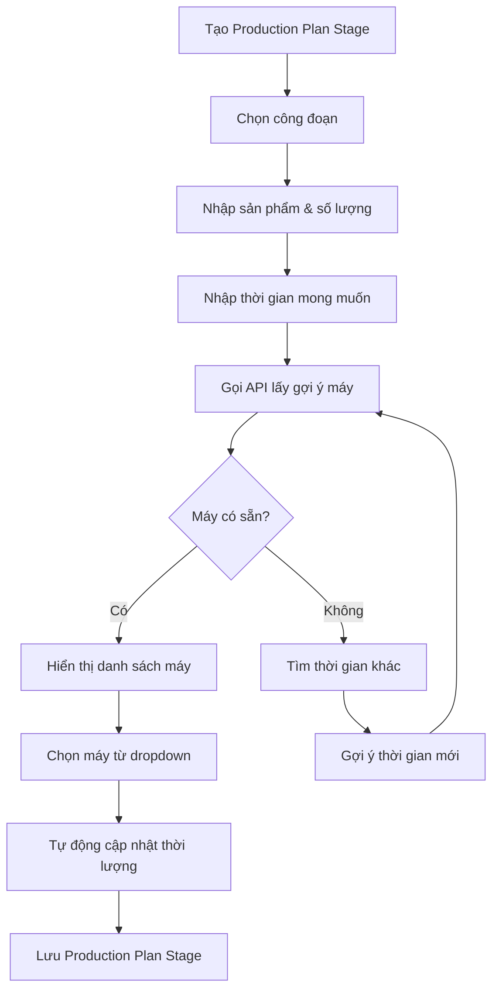

# 🤖 **HƯỚNG DẪN SỬ DỤNG HỆ THỐNG LỰA CHỌN MÁY THÔNG MINH**

## 📋 **TỔNG QUAN**

Hệ thống Machine Selection đã được tích hợp vào Production Plan để hỗ trợ:
- ✅ **Lựa chọn máy phù hợp với công đoạn**
- ✅ **Kiểm tra khả năng sẵn sàng theo lịch chạy thực tế**
- ✅ **Tự động gán máy và tính toán thời gian**
- ✅ **Phát hiện xung đột lịch trình**

---

## 🎯 **CÁC TÍNH NĂNG CHÍNH**

### **1. Lựa chọn máy phù hợp với công đoạn**

Hệ thống sẽ tự động lọc máy móc dựa trên:
- **Loại công đoạn** (`stageType`): WARPING, WEAVING, DYEING, CUTTING, SEWING, PACKAGING
- **Loại sản phẩm**: Khăn mặt, khăn tắm, khăn thể thao
- **Năng suất máy**: Dựa trên `specifications` JSON và capacity mặc định
- **Trạng thái máy**: Chỉ chọn máy AVAILABLE

### **2. Kiểm tra khả năng sẵn sàng theo lịch chạy thực tế**

Hệ thống kiểm tra:
- **Bảo trì máy**: `MachineMaintenance` đang IN_PROGRESS
- **ProductionPlanStage**: Máy đã được gán cho kế hoạch khác
- **WorkOrder đang chạy**: `MachineAssignment` chưa được release
- **Xung đột thời gian**: Chồng lấn lịch trình

### **3. Tính toán thông minh**

- **Thời lượng**: `estimatedDurationHours = requiredQuantity / capacityPerHour`
- **Điểm ưu tiên**: Khả dụng (40%) + Năng suất (30%) + Vị trí (20%) + Phù hợp số lượng (10%)
- **Gợi ý thời gian**: Tự động tìm khoảng thời gian sẵn sàng tiếp theo

---

## 🚀 **API ENDPOINTS**

### **Machine Selection Controller**

#### **1. Lấy gợi ý máy móc**
```http
GET /v1/machine-selection/suitable-machines
```
**Parameters:**
- `stageType`: Loại công đoạn (WARPING, WEAVING, etc.)
- `productId`: ID sản phẩm
- `requiredQuantity`: Số lượng cần sản xuất
- `preferredStartTime`: Thời gian bắt đầu mong muốn (optional)
- `preferredEndTime`: Thời gian kết thúc mong muốn (optional)

**Response:**
```json
[
  {
    "machineId": 1,
    "machineCode": "CM-01",
    "machineName": "Máy cuộn mắc 01",
    "machineType": "WARPING",
    "location": "Khu A",
    "capacityPerHour": 200.0,
    "estimatedDurationHours": 4.0,
    "canHandleQuantity": true,
    "available": true,
    "availabilityScore": 100.0,
    "conflicts": [],
    "suggestedStartTime": "2025-10-28T08:00",
    "suggestedEndTime": "2025-10-28T12:00",
    "priorityScore": 95.5
  }
]
```

#### **2. Gợi ý máy cho stage mới**
```http
POST /v1/machine-selection/suggest-machines
```
**Body:**
```json
{
  "stageType": "WARPING",
  "productId": 1,
  "requiredQuantity": 1000,
  "preferredStartTime": "2025-10-28T08:00",
  "preferredEndTime": "2025-10-28T17:00"
}
```

### **Production Plan Controller**

#### **3. Lấy gợi ý máy cho stage hiện có**
```http
GET /v1/production-plans/stages/{stageId}/machine-suggestions
```

#### **4. Tự động gán máy**
```http
POST /v1/production-plans/stages/{stageId}/auto-assign-machine
```

#### **5. Kiểm tra xung đột**
```http
GET /v1/production-plans/stages/{stageId}/check-conflicts
```

#### **6. Gợi ý máy cho stage mới**
```http
GET /v1/production-plans/machine-suggestions
```

---

## 💻 **CÁCH SỬ DỤNG TRONG UI**

### **Khi tạo Production Plan Stage:**

1. **Chọn công đoạn** (WARPING, WEAVING, etc.)
2. **Nhập thông tin sản phẩm và số lượng**
3. **Nhập thời gian mong muốn** (hoặc để trống để hệ thống gợi ý)
4. **Gọi API** để lấy danh sách máy phù hợp
5. **Hiển thị dropdown** với các máy được sắp xếp theo điểm ưu tiên
6. **Hiển thị thông tin chi tiết** cho từng máy:
   - ✅/❌ Khả dụng
   - ⏱️ Thời lượng ước tính
   - 📍 Vị trí máy
   - ⚠️ Xung đột (nếu có)
   - 🕐 Thời gian gợi ý

### **Khi chỉnh sửa Production Plan Stage:**

1. **Kiểm tra xung đột** khi thay đổi thời gian
2. **Tự động gán máy** nếu máy hiện tại không khả dụng
3. **Cập nhật thời lượng** dựa trên năng suất máy mới

---

## 🔧 **CẤU HÌNH MÁY MÓC**

### **Machine Entity cần có:**

```java
@Entity
public class Machine {
    private String type; // WARPING, WEAVING, DYEING, CUTTING, SEWING, PACKAGING
    private String status; // AVAILABLE, IN_USE, MAINTENANCE, BROKEN
    private String location; // Vị trí máy
    private String specifications; // JSON chứa capacityPerHour
}
```

### **Specifications JSON Format:**

```json
{
  "capacityPerHour": {
    "faceTowels": 150,
    "bathTowels": 70,
    "sportsTowels": 100,
    "default": 100
  },
  "features": ["auto_feed", "high_speed"],
  "maxWidth": 2000,
  "maxSpeed": 500
}
```

### **Capacity mặc định theo loại máy:**

| Loại máy | Capacity mặc định | Đơn vị |
|----------|-------------------|---------|
| WARPING  | 200               | kg/giờ  |
| WEAVING  | 50                | kg/giờ  |
| DYEING   | 1000              | kg/giờ  |
| CUTTING  | 150               | cái/giờ |
| SEWING   | 100               | cái/giờ |
| PACKAGING| 500               | cái/giờ |

---

## 📊 **THUẬT TOÁN TÍNH ĐIỂM ƯU TIÊN**

```java
priorityScore = 
    availabilityScore * 0.4 +           // 40% - Khả dụng
    capacityScore * 0.3 +              // 30% - Năng suất
    locationScore * 0.2 +              // 20% - Vị trí
    quantityFitScore * 0.1;            // 10% - Phù hợp số lượng
```

### **Ví dụ tính toán:**

**Máy CM-01:**
- Khả dụng: 100% → 100 * 0.4 = 40
- Năng suất: 200 kg/h → 200 * 0.3 = 60  
- Vị trí: Có → 20 * 0.2 = 4
- Phù hợp số lượng: Có → 10 * 0.1 = 1
- **Tổng điểm: 105**

**Máy CM-02:**
- Khả dụng: 50% → 50 * 0.4 = 20
- Năng suất: 150 kg/h → 150 * 0.3 = 45
- Vị trí: Có → 20 * 0.2 = 4  
- Phù hợp số lượng: Có → 10 * 0.1 = 1
- **Tổng điểm: 70**

→ **CM-01 sẽ được ưu tiên hơn**

---

## ⚠️ **XỬ LÝ XUNG ĐỘT**

### **Các loại xung đột:**

1. **Bảo trì máy:**
   ```
   "Máy đang bảo trì từ 2025-10-28 08:00 đến 2025-10-28 12:00"
   ```

2. **Kế hoạch khác:**
   ```
   "Máy đã được gán cho kế hoạch sản xuất từ 2025-10-28 08:00 đến 2025-10-28 17:00"
   ```

3. **Work Order đang chạy:**
   ```
   "Máy đang được sử dụng cho Work Order từ 2025-10-28 08:00"
   ```

### **Giải pháp:**

1. **Tự động tìm thời gian khác**
2. **Gợi ý máy khác**
3. **Chia nhỏ công việc**
4. **Điều chỉnh lịch trình**

---

## 🎯 **WORKFLOW HOÀN CHỈNH**



---

## 🔍 **DEBUGGING & MONITORING**

### **Log quan trọng:**

```java
// Trong MachineSelectionService
log.info("Found {} suitable machines for stage {}", suggestions.size(), stageType);
log.warn("Machine {} has conflicts: {}", machineId, conflicts);
log.error("No suitable machines found for stage {}", stageType);
```

### **Kiểm tra dữ liệu:**

```sql
-- Kiểm tra máy móc
SELECT * FROM machine WHERE type = 'WARPING' AND status = 'AVAILABLE';

-- Kiểm tra bảo trì
SELECT * FROM machine_maintenance WHERE status = 'IN_PROGRESS';

-- Kiểm tra gán máy
SELECT * FROM machine_assignment WHERE released_at IS NULL;
```

---

## 🚀 **TÍNH NĂNG NÂNG CAO**

### **1. Machine Learning (Tương lai):**
- Học từ lịch sử sử dụng máy
- Dự đoán thời gian bảo trì
- Tối ưu hóa lịch trình

### **2. Real-time Updates:**
- WebSocket cho cập nhật real-time
- Thông báo khi máy thay đổi trạng thái
- Dashboard theo dõi máy móc

### **3. Advanced Scheduling:**
- Thuật toán genetic algorithm
- Tối ưu hóa đa mục tiêu
- Tích hợp với ERP system

---

## 📞 **HỖ TRỢ**

Nếu gặp vấn đề, hãy kiểm tra:

1. **Machine data** có đầy đủ không
2. **Specifications JSON** có đúng format không  
3. **Time zone** có nhất quán không
4. **Database indexes** có được tạo không

**Contact:** Development Team
**Version:** 1.0.0
**Last Updated:** 2025-10-26
